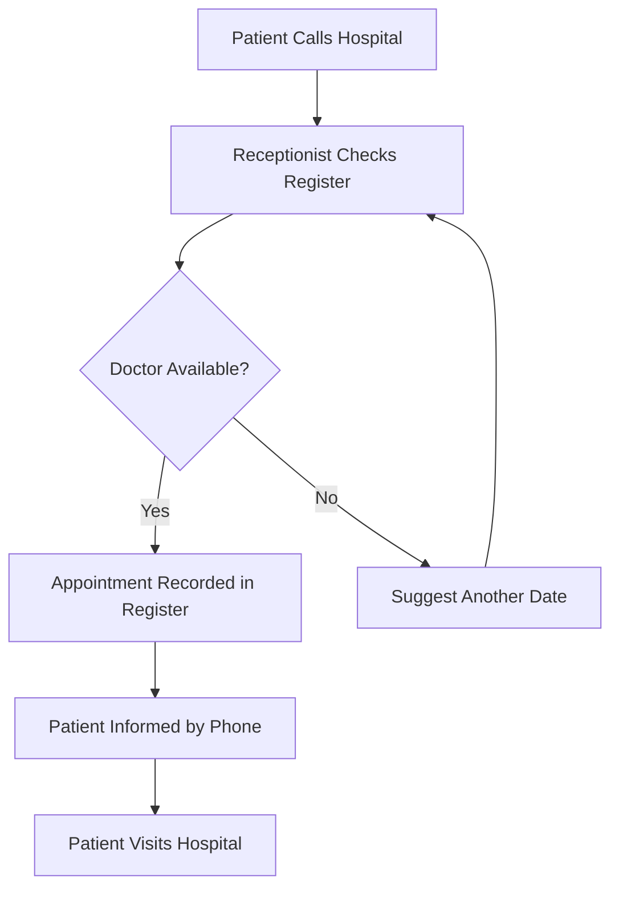
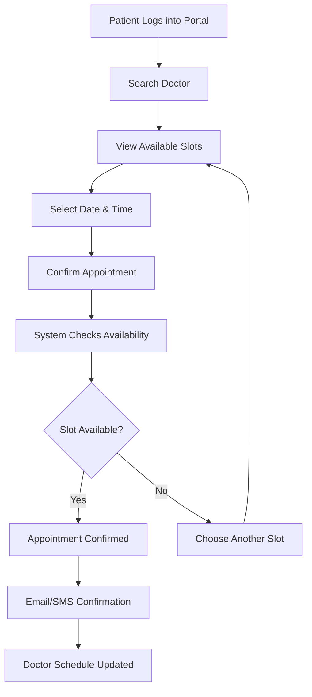

# Process Flow Diagrams

## As-Is Process (Current Manual System)

```mermaid
flowchart TD
A[Patient Calls Hospital] --> B[Receptionist Checks Register]
B --> C{Doctor Available?}
C -->|Yes| D[Appointment Recorded in Register]
D --> E[Patient Informed by Phone]
E --> F[Patient Visits Hospital]
C -->|No| G[Suggest Another Date]
G --> B
```

---

## To-Be Process (Proposed Digital System)

```mermaid
flowchart TD
A[Patient Logs into Portal] --> B[Search Doctor]
B --> C[View Available Slots]
C --> D[Select Date & Time]
D --> E[Confirm Appointment]
E --> F[System Checks Availability]
F --> G{Slot Available?}
G -->|Yes| H[Appointment Confirmed]
H --> I[Email/SMS Confirmation]
I --> J[Doctor Schedule Updated]
G -->|No| K[Choose Another Slot]
K --> C
```
